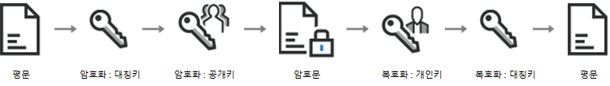

# ServerSample
## 테스트용 서버 샘플

 - 자바 샘플1 (Blocking Socket)  : [SampleServer](https://github.com/zojae031/ServerSample/tree/master/ServerSample/SampleServer)
 - 자바 샘플2 (Non_Blocking Socket) : [Nio_Server](https://github.com/zojae031/ServerSample/blob/master/ServerSample/NIO_Server/src/Server.java)  
</hr>  

## 암호화 (테스트용 서버 샘플 기반 예제)
 - 코틀린 암호화 서버 : [encryptionServer](https://github.com/zojae031/ServerSample/tree/master/ServerSample/encryptionServer)
 1. [AES](https://github.com/zojae031/ServerSample/blob/master/ServerSample/encryptionServer/src/AES.kt),[RSA](https://github.com/zojae031/ServerSample/blob/master/ServerSample/encryptionServer/src/RSA.kt) 암호화 복호화기능 
 2. 클라이언트에서 AES -> RSA로 암호화 된 문자열을 받아서 복호화함 : [Client.kt](https://github.com/zojae031/ServerSample/blob/master/ServerSample/encryptionServer/src/Client.kt)  
 ```키쌍을 따로 생성하여 이 예제는 실행되지 않음```
 3. 사용 예제 [example.kt](https://github.com/zojae031/ServerSample/blob/master/ServerSample/encryptionServer/src/example.kt)
 
 - 코틀린 암호화 클라이언트 : [encryptionTest](https://github.com/zojae031/ServerSample/tree/master/ServerSample/encryptionTest)
 1. MVP를 통하여 구현
 2. Model의 [UseCase.kt](https://github.com/zojae031/ServerSample/blob/master/ServerSample/encryptionTest/app/src/main/java/encryption/encryptiontest/Model/UseCase.kt) 에서 암호화가 이루어짐  
 
 <hr>  
 
 ### 위 예제는 연습용 코드입니다.  
 ```실 동작을 위해서는 같은 KeyPair를 사용해야 함```
 
 <hr>
 
 ### 암호화 기법 [RSA + AES]

 + RSA : 공개 키 암호방식  
장점 : 보안성이 뛰어남  
단점 : 길이제한, 속도 느림

 + AES : 대칭 키 암호방식  
장점 : 길이제한x, 속도 빠름  
단점 : 대칭 키 

+ Encryption 사용방법 ( RSA와 AES의 장점만을 이용 )
1. Server : RSA Key Pair를 생성
2. Server : public Key를 Client로 전송
3. Client : 평문을 AES로 암호화 (symmetric_key)
4. Client : 암호화된 평문을 RSA로 암호화 (public_key)
5. Client : 두 번 암호화된 평문을 서버로 전송
6. Server : 암호화된 평문을 RSA로 복호화 (private_key)
7. Server : 암호화된 평문을 AES로 복호화 (symmetric_key) - 복호화 완료

<hr>


